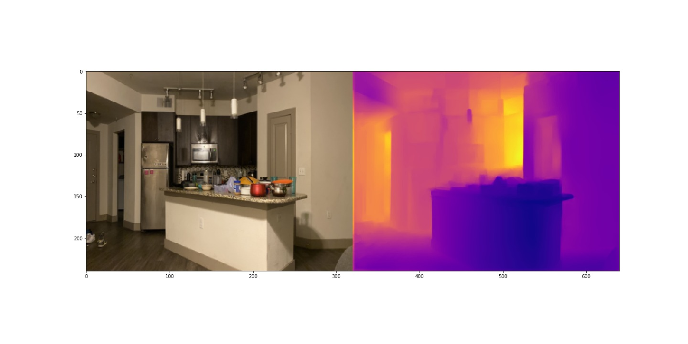
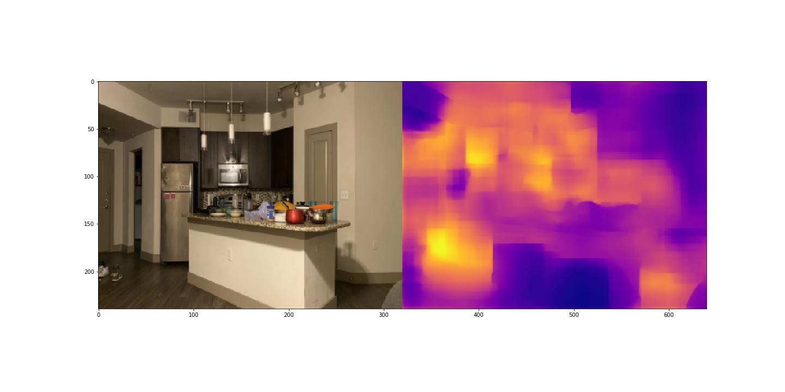

# depth-estimation
## [High Quality Monocular Depth Estimation via Transfer Learning (arXiv 2018)](https://arxiv.org/abs/1812.11941)
**[Ibraheem Alhashim](https://ialhashim.github.io/)** and **Peter Wonka**

The original code is at the repo [Dense Depth Original Code](https://github.com/ialhashim/DenseDepth)
This version has been modified here to 
* Add support for U-Net encoders
* Create webcam based test to the model on realtime images

## Requirements
* This code is tested with `Keras 2.2.4`, `Tensorflow 1.13`, `CUDA 9.0`, on Google Colab.
* Other packages needed `keras pillow matplotlib scikit-learn scikit-image opencv-python pydot` and `GraphViz`.


## Data
* [NYU Depth V2 (50K)](https://s3-eu-west-1.amazonaws.com/densedepth/nyu_data.zip) (4.1 GB): You don't need to extract the dataset since the code loads the entire zip file into memory when training.

## Download a pretrained model from the original paper
* [NYU Depth V2](https://s3-eu-west-1.amazonaws.com/densedepth/nyu.h5) (165 MB)


The Above paper used the pre-trained keras DenseNet201, DenseNet121, DenseNet169 and ResNet50 models, We used [unet](https://lmb.informatik.uni-freiburg.de/people/ronneber/u-net/) [Model](https://github.com/zhixuhao/unet) encoder and decoder model with the same optimizer and the loss function to replicate the result

## Training with UNet encoder
* Train the model: 
```
python depth_estimation.py 5 5 0.001

# First argument : batch_size
# Second argument: epochs
# Third argument: : learing rate
```

Once the model is created you can check the depth measured image result using webcam with following command
* webcam result verification 
```
python video_display.py model.h5 

# model.h5 is the created model
```

## Download a pretrained model from our approach
* [UNet trained model](https://drive.google.com/open?id=1WbVr3e7-kVDRtShCuaK-BtlzUePXYFWm) (477 MB)

## Result Comparison

* The original paper model response:

<p align="left">
  
</p>

* U-Net Model response:

<p align="left">
  
</p>


## Reference
Corresponding paper to cite:
```
@article{Alhashim2018,
  author    = {Ibraheem Alhashim and Peter Wonka},
  title     = {High Quality Monocular Depth Estimation via Transfer Learning},
  journal   = {arXiv e-prints},
  volume    = {abs/1812.11941},
  year      = {2018},
  url       = {https://arxiv.org/abs/1812.11941},
  eid       = {arXiv:1812.11941},
  eprint    = {1812.11941}
}
```

